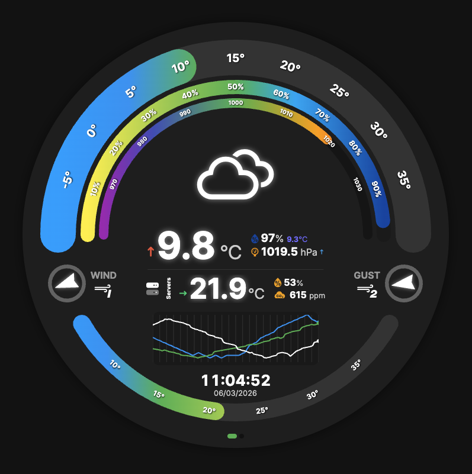

# Home Assistant Round Display Dashboard

A real-time Home Assistant dashboard designed for a Raspberry Pi with a 720x720px round display. Displays weather and sensor data via concentric SVG gauges, sparkline charts, wind compasses, and multi-room indoor readings.



## Features

- Real-time WebSocket connection to Home Assistant with auto-reconnect
- Concentric SVG gauges for temperature, humidity, pressure, and rainfall
- 24-hour sparkline history charts for temperature, humidity, pressure, and rainfall
- Wind direction/speed compass with Beaufort scale (wind + gust)
- Multi-room indoor display (up to 5 rooms) with auto-scrolling
- Weather condition icons with day/night variants
- Auto-switching between conditions and rain view based on rainfall
- Clock display with time and date
- Hidden status overlay accessible via triple-tap (connection info, debug actions)
- Dark theme optimized for circular 720x720 display

## Installation

1. Clone this repository:

```bash
git clone https://github.com/MarkGriffiths/hass-display.git
cd hass-display
```

2. Install dependencies:

```bash
pnpm install
```

3. Create a `.env` file in the project root with your Home Assistant configuration:

```env
HA_URL=http://your-home-assistant:8123
HA_ACCESS_TOKEN=your-long-lived-access-token

# Entity IDs for sensors (30+ mappings available)
HA_TEMPERATURE_ENTITY=sensor.outdoor_temperature
HA_HUMIDITY_ENTITY=sensor.outdoor_humidity
HA_PRESSURE_ENTITY=sensor.barometric_pressure
# ... see .env.example or server.js for all available entity mappings
```

4. Start the application:

```bash
pnpm start        # Production server on port 3000
pnpm dev          # Development server with auto-reload
```

5. Open your browser to `http://localhost:3000`

## Creating a Long-Lived Access Token

1. Log in to your Home Assistant instance
2. Click on your profile (bottom left corner)
3. Scroll down to "Long-Lived Access Tokens"
4. Create a new token with a name like "Display App"
5. Copy the token into your `.env` file

## Architecture

- **Backend:** Express server (`server.js`) serving static files and proxying Home Assistant API calls
- **Frontend:** Vanilla JavaScript ES6 modules, no build step
- **Connection:** Direct WebSocket to Home Assistant with exponential backoff reconnect and ping/pong keepalive
- **Data flow:** HA WebSocket &rarr; `ha-connection.js` &rarr; `entity-listeners.js` &rarr; gauge/sparkline/UI updates &rarr; DOM/SVG re-render

## Customization

- `public/js/config.js` — Value ranges, gauge geometry, color schemes, weather icon mappings
- `public/css/modules/` — Modular CSS files for each UI component
- `.env` — Entity ID mappings and Home Assistant connection settings

## Running on Boot

To auto-start on a Raspberry Pi using PM2:

```bash
npm install -g pm2
pm2 start server.js --name "ha-display"
pm2 save
pm2 startup
```

## License

MIT
